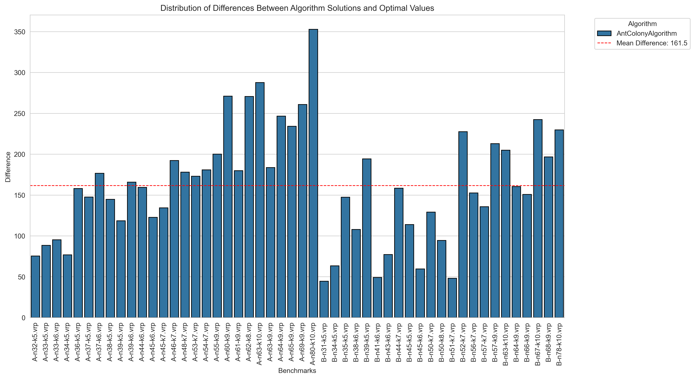

# IO-Lab6-VRP

The Vehicle Routing Problem (VRP)

# Для работы

Склонируйте репозиторий, создайте виртуальное окружение и используйте следующие команды находясь в нем:

Подтяните необходимые зависимости из файла
```
pip install -r requirements.txt
```

Для запуска бенчмарков и получения result.csv
```
python -m src.benchmarks
```

Для построения графиков
```
python -m plots
```

# **Отчет**

Мы реализовали алгоритм колонии муравьёв для решения The Vehicle Routing Problem.

Результаты работы сохранены в папку results в подпапки A и B с расширением .sol

## Гиперпараметры: 

Значения:
- **alpha** = 0.5, 
- **beta** = 5.0, 
- **phi** = 0.3, 
- **q** = 100, 
- **num_ants** = 10, 
- **iterations** = 100

Обозначения:

- **alpha** = влияние феромонов, 
- **beta** = влияние эвристики, 
- **phi** = коэффициент испарения феромонов, 
- **q** = количество феромонов для добавления, 
- **num_ants** = количество муравьев, 
- **iterations** = количество итераций

# **Таблица:**

Хранится в папке src под названием **results.csv**

# **График решения**

Для каждого бенчмарка можно посмотреть график решения в папке plots в подпапке A или B:


# **Время работы:**


В целом, ожидаемое время работы - алгоритм зависит от количества муравьев и итераций.

# **Итоговые результаты:**


В сравнении с оптимальными значениями:


Разница с оптимальными значениями (абсолютная и в процентах):



В процентах:


