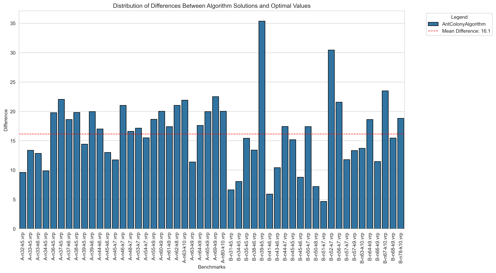

# IO-Lab6-VRP

The Vehicle Routing Problem (VRP)

# Для работы

Склонируйте репозиторий, создайте виртуальное окружение и используйте следующие команды находясь в нем:

Подтяните необходимые зависимости из файла
```
pip install -r requirements.txt
```

Для запуска бенчмарков и получения result.csv
```
python -m src.benchmarks
```

Для построения графиков
```
python -m plots
```

# **Отчет**

Мы реализовали алгоритм колонии муравьёв для решения The Vehicle Routing Problem.

Результаты работы сохранены в папку results в подпапки A и B с расширением .sol

## Гиперпараметры: 

Значения:
- **alpha** = 0.5, 
- **beta** = 5.0, 
- **phi** = 0.3, 
- **q** = 100, 
- **num_ants** = 10, 
- **iterations** = 100

Обозначения:

- **alpha** = влияние феромонов, 
- **beta** = влияние эвристики, 
- **phi** = коэффициент испарения феромонов, 
- **q** = количество феромонов для добавления, 
- **num_ants** = количество муравьев, 
- **iterations** = количество итераций

# **Таблица:**

Хранится в папке src под названием **results.csv**

| benchmark         | alg                 | best_total_cost | avg_time_sec | solution                                                                                                                                                                                                 | optimal_value | diff         | percent_diff  |
|-------------------|---------------------|------------------|--------------|----------------------------------------------------------------------------------------------------------------------------------------------------------------------------------------------------------|---------------|--------------|---------------|
| A-n32-k5.vrp      | AntColonyAlgorithm  | 859.2660787      | 1.8464479    | [1, 21, 6, 26, 11, 16, 23, 10, 9, 19, 30, 27, 1] [1, 7, 24, 3, 4, 5, 12, 29, 15, 1] [1, 28, 25, 31, 17, 2, 1] [1, 18, 20, 32, 22, 14, 8, 1] [1, 13, 1]                                               | 784           | 75.2660787   | 9.6002651     |
| A-n33-k5.vrp      | AntColonyAlgorithm  | 749.3725014      | 1.8743251    | [1, 23, 24, 29, 19, 12, 32, 22, 1] [1, 3, 33, 14, 9, 8, 27, 6, 13, 1] [1, 11, 28, 31, 26, 5, 21, 1] [1, 16, 10, 18, 4, 17, 30, 2, 1] [1, 25, 7, 20, 15, 1]                                           | 661           | 88.3725014   | 13.3695161    |
| A-n33-k6.vrp      | AntColonyAlgorithm  | 837.2191503      | 1.7248859    | [1, 29, 26, 22, 17, 31, 28, 1] [1, 33, 11, 15, 18, 12, 30, 1] [1, 25, 24, 23, 27, 5, 9, 32, 1] [1, 20, 21, 16, 3, 4, 10, 8, 1] [1, 14, 2, 19, 7, 6, 1] [1, 13, 1]                                    | 742           | 95.2191503   | 12.8327696    |
| A-n34-k5.vrp      | AntColonyAlgorithm  | 854.7340931      | 1.7513544    | [1, 21, 27, 5, 34, 17, 23, 10, 1] [1, 19, 3, 13, 4, 33, 29, 32, 26, 1] [1, 22, 11, 14, 18, 20, 12, 24, 28, 1] [1, 15, 7, 16, 9, 2, 8, 1] [1, 6, 31, 25, 30, 1]                                       | 778           | 76.7340931   | 9.862994      |
| A-n36-k5.vrp      | AntColonyAlgorithm  | 956.9381259      | 1.8858095    | [1, 17, 11, 27, 8, 21, 12, 1] [1, 6, 26, 28, 25, 22, 23, 33, 18, 1] [1, 2, 14, 31, 30, 34, 19, 32, 20, 5, 7, 24, 1] [1, 29, 15, 35, 3, 36, 9, 16, 1] [1, 10, 4, 13, 1]                               | 799           | 157.9381259  | 19.7669745    |
| A-n37-k5.vrp      | AntColonyAlgorithm  | 816.4965891      | 1.9105468    | [1, 16, 22, 17, 8, 5, 23, 14, 4, 1] [1, 35, 37, 33, 29, 32, 27, 31, 26, 19, 30, 1] [1, 2, 13, 18, 15, 24, 25, 10, 12, 28, 9, 1] [1, 34, 6, 7, 11, 3, 20, 21, 1] [1, 36, 1]                          | 669           | 147.4965891  | 22.0473227    |
| A-n37-k6.vrp      | AntColonyAlgorithm  | 1125.5633613     | 1.8694202    | [1, 15, 7, 21, 2, 4, 6, 34, 10, 29, 13, 1] [1, 37, 30, 25, 8, 17, 19, 5, 1] [1, 9, 22, 3, 24, 23, 12, 1] [1, 27, 11, 31, 16, 26, 28, 1] [1, 14, 32, 20, 35, 18, 1] [1, 36, 33, 1]                    | 949           | 176.5633613  | 18.6052014    |
| A-n38-k5.vrp      | AntColonyAlgorithm  | 874.6435572      | 1.9224244    | [1, 25, 15, 3, 37, 18, 14, 16, 33, 20, 11, 22, 1] [1, 10, 9, 34, 24, 36, 27, 13, 4, 1] [1, 35, 7, 30, 31, 19, 1] [1, 8, 6, 23, 28, 12, 38, 1] [1, 21, 29, 32, 26, 17, 5, 2, 1]                       | 730           | 144.6435572  | 19.8141859    |
| A-n39-k5.vrp      | AntColonyAlgorithm  | 940.3924522      | 1.9765403    | [1, 15, 5, 19, 10, 13, 32, 1] [1, 22, 31, 14, 29, 37, 7, 27, 18, 12, 1] [1, 20, 26, 34, 24, 21, 2, 39, 16, 30, 6, 1] [1, 9, 11, 33, 17, 8, 4, 23, 3, 1] [1, 25, 35, 38, 36, 28, 1]                   | 822           | 118.3924522  | 14.4029747    |
| A-n39-k6.vrp      | AntColonyAlgorithm  | 996.8134786      | 1.9585677    | [1, 27, 12, 7, 2, 37, 22, 35, 24, 1] [1, 25, 4, 39, 13, 30, 29, 10, 6, 1] [1, 16, 14, 31, 1] [1, 38, 32, 15, 3, 20, 34, 26, 36, 1] [1, 21, 33, 28, 11, 17, 5, 8, 9, 18, 1] [1, 19, 23, 1]            | 831           | 165.8134786  | 19.9534872    |
| A-n44-k6.vrp      | AntColonyAlgorithm  | 1096.2694575     | 2.2120437    | [1, 32, 9, 16, 29, 28, 20, 25, 1] [1, 8, 6, 33, 22, 38, 43, 12, 11, 27, 10, 1] [1, 3, 42, 15, 39, 37, 23, 7, 1] [1, 5, 35, 18, 13, 4, 26, 40, 1] [1, 14, 2, 36, 19, 21, 17, 24, 1] [1, 30, 44, 41, 31, 34, 1] | 937           | 159.2694575  | 16.9978076    |
| A-n45-k6.vrp      | AntColonyAlgorithm  | 1066.629704      | 2.2270989    | [1, 24, 10, 29, 8, 33, 14, 21, 11, 1] [1, 23, 17, 5, 43, 37, 40, 13, 3, 1] [1, 2, 45, 7, 25, 38, 12, 20, 1] [1, 15, 36, 32, 39, 26, 16, 1] [1, 27, 30, 44, 19, 18, 28, 1] [1, 31, 41, 35, 6, 22, 9, 42, 34, 1] | 944           | 122.629704   | 12.9904347    |
| A-n45-k7.vrp      | AntColonyAlgorithm  | 1280.3782964     | 2.223974     | [1, 13, 3, 35, 27, 5, 22, 10, 9, 39, 8, 1] [1, 40, 36, 33, 14, 19, 17, 21, 41, 1] [1, 7, 29, 4, 12, 44, 42, 32, 6, 1] [1, 11, 23, 31, 38, 2, 1] [1, 18, 24, 26, 43, 16, 15, 1] [1, 20, 37, 30, 28, 1] [1, 25, 45, 34, 1] | 1146          | 134.3782964  | 11.7258548    |
| A-n46-k7.vrp      | AntColonyAlgorithm  | 1106.1721725     | 2.2872172    | [1, 24, 7, 44, 15, 39, 27, 14, 46, 1] [1, 10, 29, 20, 12, 9, 34, 43, 25, 17, 4, 6, 1] [1, 18, 22, 42, 21, 32, 28, 2, 41, 35, 37, 1] [1, 13, 36, 19, 26, 45, 1] [1, 40, 23, 8, 11, 33, 1] [1, 38, 3, 31, 5, 1] [1, 16, 30, 1] | 914           | 192.1721725  | 21.0254018    |
| A-n48-k7.vrp      | AntColonyAlgorithm  | 1251.0596607     | 2.3838833    | [1, 15, 18, 19, 45, 36, 33, 37, 8, 1] [1, 24, 44, 32, 6, 2, 7, 23, 1] [1, 42, 3, 11, 34, 47, 22, 1] [1, 13, 26, 20, 39, 38, 4, 41, 1] [1, 28, 16, 9, 40, 27, 21, 43, 35, 1] [1, 46, 12, 14, 10, 25, 5, 31, 30, 29, 1] [1, 48, 17, 1] | 1073          | 178.0596607  | 16.594563     |
| A-n53-k7.vrp      | AntColonyAlgorithm  | 1183.0176174     | 2.605777     | [1, 2, 5, 29, 23, 31, 45, 30, 50, 37, 51, 44, 24, 20, 16, 33, 17, 8, 26, 40, 1] [1, 32, 21, 7, 36, 39, 19, 52, 1] [1, 4, 6, 15, 22, 35, 42, 10, 1] [1, 34, 14, 53, 12, 25, 1] [1, 48, 18, 49, 43, 41, 1] [1, 13, 46, 3, 38, 11, 27, 1] [1, 47, 9, 28, 1] | 1010          | 173.0176174  | 17.1304572    |
| A-n54-k7.vrp      | AntColonyAlgorithm  | 1347.8151763     | 2.6268439    | [1, 44, 53, 31, 35, 17, 33, 7, 16, 36, 24, 21, 6, 19, 1] [1, 5, 29, 40, 51, 8, 50, 30, 1] [1, 26, 48, 52, 43, 25, 13, 3, 47, 42, 1] [1, 10, 34, 22, 45, 32, 20, 14, 1] [1, 11, 2, 37, 46, 27, 18, 39, 1] [1, 15, 28, 38, 49, 41, 9, 1] [1, 12, 54, 4, 23, 1] | 1167          | 180.8151763  | 15.4940168    |
| A-n55-k9.vrp      | AntColonyAlgorithm  | 1273.0422466     | 2.7239415    | [1, 38, 4, 18, 35, 34, 15, 5, 37, 1] [1, 26, 42, 30, 19, 49, 51, 45, 1] [1, 31, 23, 28, 20, 14, 29, 55, 1] [1, 39, 40, 50, 10, 36, 1] [1, 24, 25, 53, 2, 7, 44, 48, 17, 41, 1] [1, 21, 47, 27, 43, 32, 8, 1] [1, 52, 3, 12, 16, 54, 1] [1, 9, 22, 13, 11, 33, 6, 1] [1, 46, 1] | 1073          | 200.0422466  | 18.6432662    |
| A-n60-k9.vrp      | AntColonyAlgorithm  | 1624.9018533     | 2.9334833    | [1, 42, 19, 34, 15, 48, 24, 35, 59, 1] [1, 17, 21, 26, 47, 4, 41, 12, 5, 22, 32, 50, 3, 1] [1, 53, 39, 60, 20, 56, 36, 16, 40, 51, 1] [1, 44, 57, 13, 52, 10, 33, 28, 38, 1] [1, 8, 30, 14, 9, 27, 1] [1, 7, 29, 45, 2, 37, 11, 55, 1] [1, 25, 49, 23, 6, 1] [1, 54, 31, 43, 46, 1] [1, 18, 58, 1] | 1354          | 270.9018533  | 20.0075224    |
| A-n61-k9.vrp      | AntColonyAlgorithm  | 1213.8846588     | 2.9557613    | [1, 15, 8, 24, 20, 16, 1] [1, 52, 10, 40, 18, 58, 53, 32, 29, 5, 1] [1, 56, 14, 51, 13, 23, 44, 34, 43, 1] [1, 27, 33, 31, 38, 46, 60, 11, 1] [1, 45, 61, 12, 2, 17, 49, 36, 1] [1, 35, 19, 48, 57, 28, 30, 22, 7, 42, 21, 41, 1] [1, 25, 4, 3, 6, 55, 47, 1] [1, 39, 50, 1] [1, 9, 54, 26, 59, 1] | 1034          | 179.8846588  | 17.3969689    |
| A-n62-k8.vrp      | AntColonyAlgorithm  | 1558.6330285     | 3.0289219    | [1, 29, 16, 8, 21, 49, 13, 54, 57, 15, 6, 14, 1] [1, 53, 37, 17, 38, 23, 45, 3, 39, 1] [1, 47, 46, 48, 25, 43, 22, 1] [1, 52, 11, 30, 62, 41, 7, 33, 1] [1, 20, 31, 19, 2, 10, 12, 50, 32, 1] [1, 61, 35, 26, 5, 36, 42, 24, 28, 40, 4, 55, 56, 1] [1, 59, 51, 34, 18, 27, 60, 1] [1, 9, 44, 58, 1] | 1288          | 270.6330285  | 21.0118811    |
| A-n63-k10.vrp     | AntColonyAlgorithm  | 1601.6948661     | 3.0577456    | [1, 49, 37, 53, 31, 39, 51, 8, 30, 1] [1, 18, 63, 21, 14, 27, 5, 1] [1, 15, 9, 36, 28, 7, 42, 40, 46, 1] [1, 29, 58, 33, 48, 12, 35, 45, 52, 22, 1] [1, 32, 23, 59, 25, 24, 62, 1] [1, 41, 57, 26, 16, 50, 54, 2, 1] [1, 44, 60, 11, 19, 4, 43, 6, 20, 1] [1, 3, 10, 13, 17, 38, 1] [1, 47, 61, 55, 1] [1, 56, 34, 1] | 1314          | 287.6948661  | 21.8945865    |
| A-n63-k9.vrp      | AntColonyAlgorithm  | 1799.655646      | 3.090877     | [1, 27, 20, 8, 26, 14, 61, 62, 50, 43, 1] [1, 12, 34, 45, 16, 57, 1] [1, 21, 35, 3, 31, 30, 55, 1] [1, 13, 29, 23, 18, 36, 52, 59, 1] [1, 44, 39, 32, 47, 2, 19, 48, 5, 53, 1] [1, 11, 40, 24, 63, 58, 38, 7, 54, 1] [1, 49, 37, 25, 9, 60, 1] [1, 10, 42, 4, 28, 46, 6, 17, 1] [1, 22, 56, 33, 41, 15, 51, 1] | 1616          | 183.655646   | 11.3648296    |
| A-n64-k9.vrp      | AntColonyAlgorithm  | 1647.4632506     | 3.1178073    | [1, 7, 11, 42, 57, 53, 14, 62, 25, 17, 10, 1] [1, 54, 4, 31, 15, 28, 8, 41, 37, 45, 22, 36, 27, 44, 1] [1, 30, 26, 46, 16, 12, 58, 1] [1, 34, 49, 63, 1] [1, 35, 5, 55, 6, 59, 47, 1] [1, 43, 21, 52, 20, 38, 24, 1] [1, 39, 19, 23, 13, 29, 2, 1] [1, 33, 61, 9, 48, 64, 3, 56, 40, 32, 60, 1] [1, 51, 50, 18, 1] | 1401          | 246.4632506  | 17.5919522    |
| A-n65-k9.vrp      | AntColonyAlgorithm  | 1408.1628409     | 3.1511869    | [1, 63, 29, 24, 34, 2, 13, 14, 20, 1] [1, 18, 52, 40, 8, 64, 12, 55, 49, 58, 33, 1] [1, 50, 44, 23, 10, 15, 28, 1] [1, 6, 5, 37, 36, 38, 31, 51, 17, 1] [1, 54, 45, 57, 60, 53, 19, 1] [1, 47, 65, 7, 27, 32, 35, 48, 1] [1, 30, 56, 22, 26, 25, 9, 1] [1, 16, 4, 61, 42, 3, 39, 62, 46, 1] [1, 11, 41, 59, 21, 43, 1] | 1174          | 234.1628409  | 19.9457275    |
| A-n69-k9.vrp      | AntColonyAlgorithm  | 1419.8188029     | 3.3904353    | [1, 20, 25, 44, 53, 27, 55, 47, 6, 1] [1, 29, 35, 15, 43, 58, 12, 64, 26, 5, 48, 3, 1] [1, 8, 28, 66, 61, 56, 22, 65, 1] [1, 32, 19, 54, 10, 31, 52, 4, 16, 45, 7, 1] [1, 38, 18, 33, 49, 51, 17, 2, 11, 59, 1] [1, 24, 67, 14, 36, 46, 21, 42, 30, 1] [1, 39, 40, 57, 63, 41, 1] [1, 23, 13, 69, 60, 9, 37, 1] [1, 68, 62, 34, 50, 1] | 1159          | 260.8188029  | 22.5037794    |
| A-n80-k10.vrp     | AntColonyAlgorithm  | 2115.7971924     | 3.9816259    | [1, 50, 74, 37, 68, 67, 71, 39, 59, 33, 73, 34, 1] [1, 14, 43, 52, 78, 4, 40, 61, 32, 1] [1, 41, 22, 8, 2, 63, 45, 1] [1, 54, 77, 51, 23, 46, 5, 55, 65, 1] [1, 11, 64, 12, 25, 7, 31, 28, 6, 1] [1, 42, 26, 16, 56, 57, 70, 66, 36, 27, 20, 48, 76, 21, 1] [1, 72, 15, 53, 29, 80, 49, 19, 35, 1] [1, 38, 3, 9, 69, 62, 17, 44, 79, 47, 1] [1, 24, 13, 30, 75, 18, 1] [1, 10, 58, 60, 1] | 1763          | 352.7971924  | 20.011185     |
| B-n31-k5.vrp      | AntColonyAlgorithm  | 716.5132396      | 1.5748015    | [1, 5, 30, 23, 14, 18, 24, 1] [1, 3, 21, 28, 11, 15, 12, 16, 25, 20, 22, 1] [1, 27, 29, 13, 9, 8, 31, 1] [1, 2, 4, 7, 10, 26, 6, 1] [1, 19, 17, 1]                                                 | 672           | 44.5132396   | 6.623994      |
| B-n34-k5.vrp      | AntColonyAlgorithm  | 851.4157915      | 1.7412794    | [1, 12, 31, 34, 11, 24, 21, 13, 1] [1, 6, 7, 18, 32, 16, 14, 29, 26, 20, 1] [1, 2, 19, 10, 17, 28, 1] [1, 30, 25, 15, 4, 27, 9, 5, 23, 1] [1, 8, 22, 3, 33, 1]                                       | 788           | 63.4157915   | 8.0476893     |
| B-n35-k5.vrp      | AntColonyAlgorithm  | 1102.2683169     | 2.0792732    | [1, 18, 30, 13, 10, 17, 24, 2, 1] [1, 22, 26, 9, 32, 7, 19, 27, 4, 21, 8, 1] [1, 11, 33, 14, 3, 20, 12, 31, 23, 1] [1, 16, 6, 29, 5, 15, 25, 35, 1] [1, 34, 28, 1]                                    | 955           | 147.2683169  | 15.4207662    |
| B-n38-k6.vrp      | AntColonyAlgorithm  | 912.8952347      | 2.1887731    | [1, 27, 17, 23, 12, 33, 29, 22, 1] [1, 10, 20, 7, 32, 15, 4, 38, 3, 1] [1, 9, 18, 37, 25, 30, 13, 35, 28, 6, 1] [1, 14, 2, 11, 16, 21, 1] [1, 36, 31, 5, 19, 34, 24, 1] [1, 8, 26, 1]                | 805           | 107.8952347  | 13.4031347    |
| B-n39-k5.vrp      | AntColonyAlgorithm  | 743.1705645      | 2.3060972    | [1, 4, 32, 29, 37, 5, 36, 18, 39, 6, 1] [1, 30, 9, 15, 8, 35, 21, 14, 19, 1] [1, 28, 27, 3, 34, 22, 25, 38, 17, 31, 24, 1] [1, 2, 33, 26, 23, 13, 12, 16, 10, 1] [1, 11, 20, 7, 1]                    | 549           | 194.1705645  | 35.3680445    |
| B-n41-k6.vrp      | AntColonyAlgorithm  | 878.0193717      | 2.6520633    | [1, 25, 36, 3, 38, 10, 22, 19, 4, 1] [1, 26, 40, 39, 28, 20, 27, 1] [1, 5, 14, 9, 37, 33, 13, 1] [1, 7, 34, 12, 35, 29, 18, 15, 2, 1] [1, 11, 24, 21, 17, 41, 31, 1] [1, 6, 16, 32, 23, 8, 30, 1]    | 829           | 49.0193717   | 5.9130726     |
| B-n43-k6.vrp      | AntColonyAlgorithm  | 819.1682569      | 3.3190508    | [1, 5, 36, 42, 28, 26, 33, 30, 41, 22, 6, 1] [1, 34, 21, 19, 20, 15, 29, 38, 13, 32, 1] [1, 14, 4, 23, 25, 7, 43, 35, 18, 1] [1, 39, 9, 3, 24, 2, 8, 11, 1] [1, 27, 40, 17, 16, 37, 10, 1] [1, 31, 12, 1] | 742           | 77.1682569   | 10.4000346    |
| B-n44-k7.vrp      | AntColonyAlgorithm  | 1067.431339      | 2.6686206    | [1, 19, 17, 30, 20, 33, 7, 22, 14, 1] [1, 8, 41, 18, 6, 2, 13, 29, 16, 1] [1, 38, 42, 35, 5, 31, 43, 9, 1] [1, 27, 15, 3, 37, 25, 40, 36, 32, 21, 1] [1, 26, 34, 4, 44, 28, 1] [1, 11, 12, 10, 39, 23, 1] [1, 24, 1] | 909           | 158.431339   | 17.4291902    |
| B-n45-k5.vrp      | AntColonyAlgorithm  | 864.9023105      | 2.3976956    | [1, 40, 24, 31, 18, 11, 37, 2, 16, 1] [1, 43, 41, 13, 7, 5, 26, 27, 12, 17, 30, 9, 1] [1, 29, 10, 14, 3, 33, 38, 8, 35, 19, 1] [1, 6, 42, 44, 23, 22, 34, 20, 21, 36, 39, 32, 1] [1, 45, 15, 28, 25, 4, 1] | 751           | 113.9023105  | 15.1667524    |
| B-n45-k6.vrp      | AntColonyAlgorithm  | 737.5024028      | 2.5434813    | [1, 5, 30, 14, 26, 27, 2, 1] [1, 12, 11, 37, 3, 15, 18, 25, 35, 19, 8, 21, 1] [1, 44, 17, 31, 43, 6, 1] [1, 40, 13, 33, 29, 20, 38, 24, 9, 23, 28, 1] [1, 36, 45, 34, 41, 39, 22, 16, 1] [1, 4, 10, 32, 42, 1] | 678           | 59.5024028   | 8.7761656     |
| B-n50-k7.vrp      | AntColonyAlgorithm  | 869.9823072      | 3.0504048    | [1, 8, 31, 19, 15, 44, 25, 17, 43, 11, 4, 28, 48, 1] [1, 42, 32, 34, 23, 13, 39, 10, 36, 5, 24, 1] [1, 35, 7, 16, 41, 50, 33, 3, 49, 45, 1] [1, 26, 29, 18, 20, 1] [1, 46, 6, 22, 37, 38, 12, 21, 9, 1] [1, 30, 47, 14, 27, 1] [1, 2, 40, 1] | 741           | 128.9823072  | 17.4065192    |
| B-n50-k8.vrp      | AntColonyAlgorithm  | 1406.3864727     | 2.8700426    | [1, 3, 35, 49, 41, 45, 7, 32, 31, 21, 28, 13, 1] [1, 8, 10, 34, 38, 50, 44, 37, 12, 25, 1] [1, 16, 43, 9, 18, 22, 11, 1] [1, 26, 17, 48, 27, 5, 19, 1] [1, 15, 24, 39, 23, 47, 14, 4, 1] [1, 6, 33, 1] [1, 20, 30, 29, 2, 40, 1] [1, 42, 46, 36, 1] | 1312          | 94.3864727   | 7.1940909     |
| B-n51-k7.vrp      | AntColonyAlgorithm  | 1080.1501496     | 3.4531215    | [1, 6, 37, 41, 17, 11, 18, 3, 39, 35, 44, 1] [1, 12, 5, 27, 29, 8, 15, 1] [1, 47, 23, 25, 31, 26, 16, 24, 51, 46, 22, 1] [1, 13, 9, 28, 32, 38, 33, 42, 1] [1, 36, 34, 20, 4, 49, 40, 1] [1, 19, 30, 14, 43, 1] [1, 45, 21, 2, 10, 50, 48, 1] | 1032          | 48.1501496   | 4.6657122     |
| B-n52-k7.vrp      | AntColonyAlgorithm  | 974.3975         | 3.1356912    | [1, 42, 26, 7, 37, 19, 31, 43, 41, 45, 1] [1, 38, 48, 30, 9, 6, 52, 1] [1, 28, 11, 36, 34, 8, 44, 47, 35, 33, 39, 1] [1, 23, 27, 14, 20, 16, 50, 18, 13, 1] [1, 3, 49, 10, 17, 5, 46, 24, 51, 4, 32, 1] [1, 40, 29, 12, 22, 15, 25, 21, 1] [1, 2, 1] | 747           | 227.3975     | 30.4414324    |
| B-n56-k7.vrp      | AntColonyAlgorithm  | 859.4950747      | 3.365091     | [1, 26, 46, 42, 25, 7, 54, 16, 30, 43, 1] [1, 28, 53, 2, 17, 36, 49, 37, 50, 4, 1] [1, 38, 5, 40, 48, 8, 27, 14, 1] [1, 33, 34, 3, 32, 21, 55, 35, 31, 56, 12, 18, 1] [1, 44, 13, 10, 51, 23, 39, 24, 6, 20, 1] [1, 19, 11, 45, 15, 52, 41, 47, 9, 29, 1] [1, 22, 1] | 707           | 152.4950747  | 21.5693175    |
| B-n57-k7.vrp      | AntColonyAlgorithm  | 1288.6972637     | 3.3210244    | [1, 56, 2, 50, 49, 34, 14, 6, 45, 22, 4, 26, 52, 1] [1, 41, 36, 55, 30, 5, 47, 24, 17, 28, 25, 1] [1, 38, 40, 15, 23, 43, 3, 51, 53, 8, 1] [1, 11, 46, 32, 12, 16, 1] [1, 57, 27, 42, 20, 18, 35, 19, 1] [1, 29, 9, 13, 54, 39, 37, 10, 1] [1, 31, 48, 33, 44, 21, 1] | 1153          | 135.6972637  | 11.7690602    |
| B-n57-k9.vrp      | AntColonyAlgorithm  | 1810.94841       | 3.337777     | [1, 7, 33, 41, 4, 51, 47, 11, 1] [1, 6, 48, 37, 22, 42, 30, 54, 5, 50, 1] [1, 36, 34, 49, 39, 13, 31, 32, 1] [1, 35, 15, 45, 14, 17, 3, 8, 1] [1, 23, 57, 56, 18, 10, 29, 19, 1] [1, 9, 26, 52, 16, 38, 21, 43, 20, 1] [1, 46, 53, 25, 55, 44, 1] [1, 27, 40, 24, 12, 1] [1, 28, 2, 1] | 1598          | 212.94841    | 13.325933     |
| B-n63-k10.vrp     | AntColonyAlgorithm  | 1700.8930874     | 3.4059672    | [1, 29, 30, 49, 33, 56, 1] [1, 14, 61, 6, 32, 4, 41, 17, 1] [1, 45, 5, 50, 57, 60, 1] [1, 16, 48, 10, 23, 35, 1] [1, 31, 9, 47, 13, 55, 42, 15, 59, 44, 25, 12, 1] [1, 20, 53, 34, 27, 36, 26, 3, 63, 1] [1, 51, 19, 2, 28, 37, 21, 8, 1] [1, 11, 38, 24, 54, 39, 58, 18, 7, 1] [1, 62, 43, 40, 52, 22, 1] [1, 46, 1] | 1496          | 204.8930874  | 13.696062     |
| B-n64-k9.vrp      | AntColonyAlgorithm  | 1021.2544716     | 3.3989172    | [1, 20, 16, 15, 52, 56, 6, 25, 1] [1, 8, 31, 47, 42, 55, 9, 22, 28, 39, 18, 10, 4, 1] [1, 2, 53, 63, 27, 32, 41, 1] [1, 33, 38, 13, 11, 19, 62, 48, 5, 1] [1, 51, 61, 37, 49, 36, 60, 23, 1] [1, 34, 30, 12, 29, 57, 14, 17, 1] [1, 44, 50, 35, 1] [1, 26, 24, 58, 43, 64, 3, 21, 1] [1, 46, 45, 59, 54, 7, 40, 1] | 861           | 160.2544716  | 18.6125983    |
| B-n66-k9.vrp      | AntColonyAlgorithm  | 1466.658723      | 3.6648365    | [1, 42, 21, 54, 55, 19, 24, 2, 1] [1, 53, 18, 56, 32, 46, 14, 57, 20, 36, 31, 1] [1, 59, 33, 43, 28, 6, 4, 30, 40, 15, 1] [1, 34, 66, 9, 41, 5, 16, 61, 22, 37, 1] [1, 3, 11, 27, 47, 64, 60, 1] [1, 10, 50, 25, 13, 7, 51, 1] [1, 29, 63, 38, 49, 26, 17, 62, 1] [1, 35, 52, 44, 23, 39, 58, 8, 1] [1, 48, 45, 65, 12, 1] | 1316          | 150.658723   | 11.4482312    |
| B-n67-k10.vrp     | AntColonyAlgorithm  | 1274.4017983     | 4.202653     | [1, 6, 29, 14, 59, 13, 23, 55, 1] [1, 49, 10, 26, 22, 64, 16, 57, 56, 19, 1] [1, 54, 40, 43, 45, 41, 65, 37, 36, 5, 15, 1] [1, 52, 25, 30, 60, 42, 28, 11, 67, 33, 1] [1, 46, 53, 38, 66, 24, 9, 44, 1] [1, 32, 34, 48, 27, 3, 17, 1] [1, 35, 7, 2, 50, 20, 21, 1] [1, 47, 51, 12, 8, 18, 1] [1, 63, 62, 58, 31, 4, 61, 1] [1, 39, 1] | 1032          | 242.4017983  | 23.4885463    |
| B-n68-k9.vrp      | AntColonyAlgorithm  | 1468.6166092     | 4.2898901    | [1, 57, 34, 16, 2, 32, 65, 28, 36, 61, 1] [1, 39, 54, 24, 40, 12, 4, 26, 20, 64, 37, 33, 1] [1, 5, 48, 44, 67, 66, 8, 1] [1, 47, 14, 15, 63, 6, 55, 22, 31, 17, 45, 1] [1, 50, 23, 3, 38, 42, 9, 1] [1, 35, 49, 46, 13, 60, 10, 62, 1] [1, 18, 53, 21, 27, 52, 58, 59, 25, 7, 1] [1, 19, 11, 29, 43, 30, 68, 1] [1, 56, 41, 51, 1] | 1272          | 196.6166092  | 15.4572806    |
| B-n78-k10.vrp     | AntColonyAlgorithm  | 1450.6307548     | 4.6409248    | [1, 18, 73, 59, 39, 70, 68, 44, 22, 53, 1] [1, 2, 25, 57, 48, 28, 64, 50, 66, 31, 1] [1, 3, 6, 76, 38, 71, 30, 32, 1] [1, 9, 23, 72, 8, 33, 74, 4, 55, 21, 11, 17, 1] [1, 58, 77, 46, 47, 35, 52, 1] [1, 78, 24, 45, 27, 12, 65, 41, 54, 26, 1] [1, 43, 69, 19, 61, 7, 15, 42, 37, 29, 20, 10, 62, 1] [1, 63, 40, 75, 49, 14, 56, 67, 1] [1, 5, 60, 36, 34, 51, 1] [1, 13, 16, 1] | 1221          | 229.6307548  | 18.8067776    |

# **График решения**

Для каждого бенчмарка можно посмотреть график решения в папке plots в подпапке A или B:


# **Время работы:**


В целом, ожидаемое время работы - алгоритм зависит от количества муравьев и итераций.

# **Итоговые результаты:**


В сравнении с оптимальными значениями:


Разница с оптимальными значениями (абсолютная и в процентах):


В процентах:


