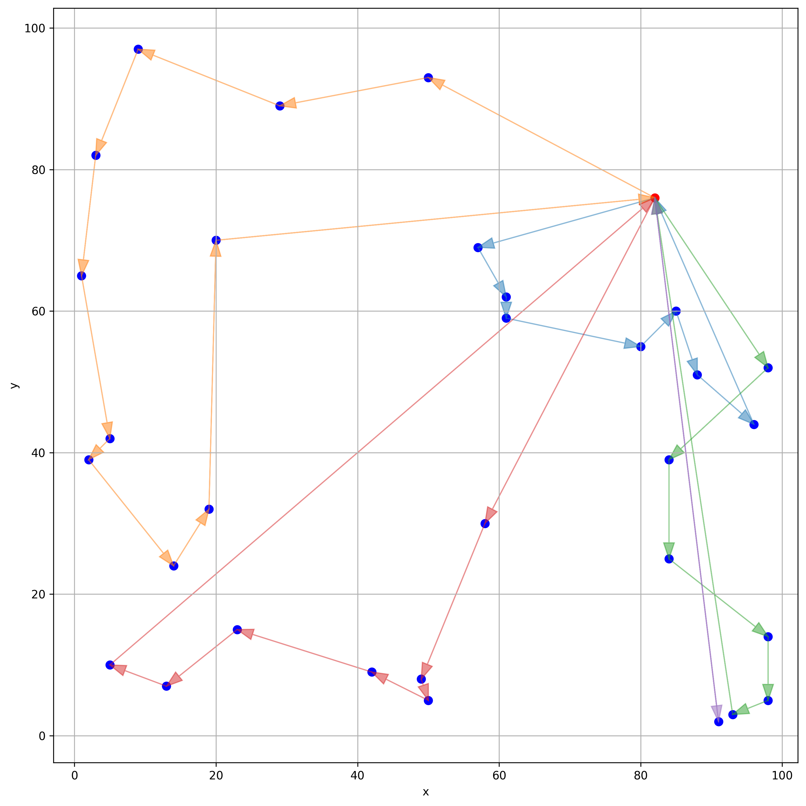
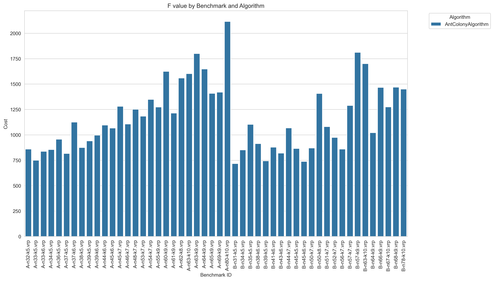

# IO-Lab6-VRP

The Vehicle Routing Problem (VRP)

# Для работы

Склонируйте репозиторий, создайте виртуальное окружение и используйте следующие команды находясь в нем:

Подтяните необходимые зависимости из файла
```
pip install -r requirements.txt
```

Для запуска бенчмарков и получения result.csv
```
python -m src.benchmarks
```

Для построения графиков
```
python -m plots
```

# **Отчет**

Мы реализовали алгоритм колонии муравьёв для решения The Vehicle Routing Problem.

Результаты работы сохранены в папку results в подпапки A и B с расширением .sol

## Гиперпараметры: 

Значения:
- **alpha** = 0.5, 
- **beta** = 5.0, 
- **phi** = 0.3, 
- **q** = 100, 
- **num_ants** = 10, 
- **iterations** = 100

Обозначения:

- **alpha** = влияние феромонов, 
- **beta** = влияние эвристики, 
- **phi** = коэффициент испарения феромонов, 
- **q** = количество феромонов для добавления, 
- **num_ants** = количество муравьев, 
- **iterations** = количество итераций

# **Таблица:**

Хранится в папке src под названием **results.csv**

| benchmark         | alg                 | best_total_cost | avg_time_sec | solution                                                                                                                                                                                                 | optimal_value | diff         | percent_diff  |
|-------------------|---------------------|------------------|--------------|----------------------------------------------------------------------------------------------------------------------------------------------------------------------------------------------------------|---------------|--------------|---------------|
| A-n32-k5.vrp      | AntColonyAlgorithm  | 859.2660787      | 1.8464479    | [1, 21, 6, 26, 11, 16, 23, 10, 9, 19, 30, 27, 1] [1, 7, 24, 3, 4, 5, 12, 29, 15, 1] [1, 28, 25, 31, 17, 2, 1] [1, 18, 20, 32, 22, 14, 8, 1] [1, 13, 1]                                               | 784           | 75.2660787   | 9.6002651     |
| A-n33-k5.vrp      | AntColonyAlgorithm  | 749.3725014      | 1.8743251    | [1, 23, 24, 29, 19, 12, 32, 22, 1] [1, 3, 33, 14, 9, 8, 27, 6, 13, 1] [1, 11, 28, 31, 26, 5, 21, 1] [1, 16, 10, 18, 4, 17, 30, 2, 1] [1, 25, 7, 20, 15, 1]                                           | 661           | 88.3725014   | 13.3695161    |
| A-n33-k6.vrp      | AntColonyAlgorithm  | 837.2191503      | 1.7248859    | [1, 29, 26, 22, 17, 31, 28, 1] [1, 33, 11, 15, 18, 12, 30, 1] [1, 25, 24, 23, 27, 5, 9, 32, 1] [1, 20, 21, 16, 3, 4, 10, 8, 1] [1, 14, 2, 19, 7, 6, 1] [1, 13, 1]                                    | 742           | 95.2191503   | 12.8327696    |
| A-n34-k5.vrp      | AntColonyAlgorithm  | 854.7340931      | 1.7513544    | [1, 21, 27, 5, 34, 17, 23, 10, 1] [1, 19, 3, 13, 4, 33, 29, 32, 26, 1] [1, 22, 11, 14, 18, 20, 12, 24, 28, 1] [1, 15, 7, 16, 9, 2, 8, 1] [1, 6, 31, 25, 30, 1]                                       | 778           | 76.7340931   | 9.862994      |

# **График решения**

Для каждого бенчмарка можно посмотреть график решения в папке plots в подпапке A или B:



# **Время работы:**


В целом, ожидаемое время работы - алгоритм зависит от количества муравьев и итераций.

# **Итоговые результаты:**



В сравнении с оптимальными значениями:


Разница с оптимальными значениями (абсолютная и в процентах):


В процентах:


